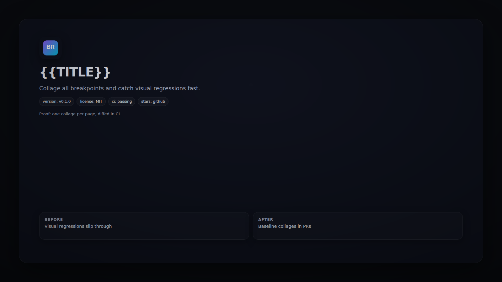

# breakpoint-collage-diff



   

Collage all breakpoints and catch visual regressions fast.

## Quickstart
```bash
npx breakpoint-collage-diff --url https://example.com
```

## Demo
```bash
breakpoint-collage-diff --urls urls.txt --breakpoints 375,768,1280
```

## Why This Exists
Playwright screenshots stitched into a single, reviewable artifact.

## FAQ
- **Does it upload artifacts?** Yes, via GitHub Actions.
- **Can it comment on PRs?** Optional via workflow.

## Contributing
See `CONTRIBUTING.md` for test and render steps.

## License
MIT
