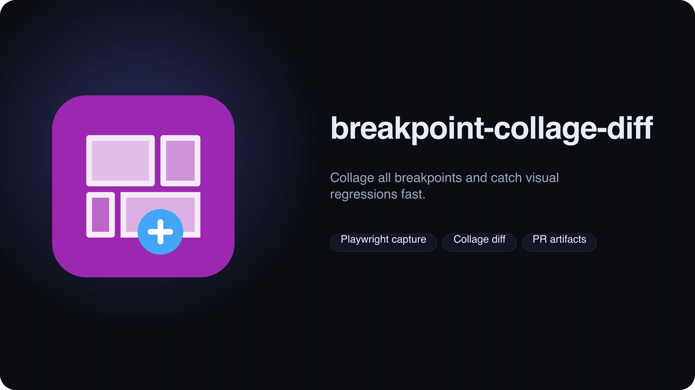
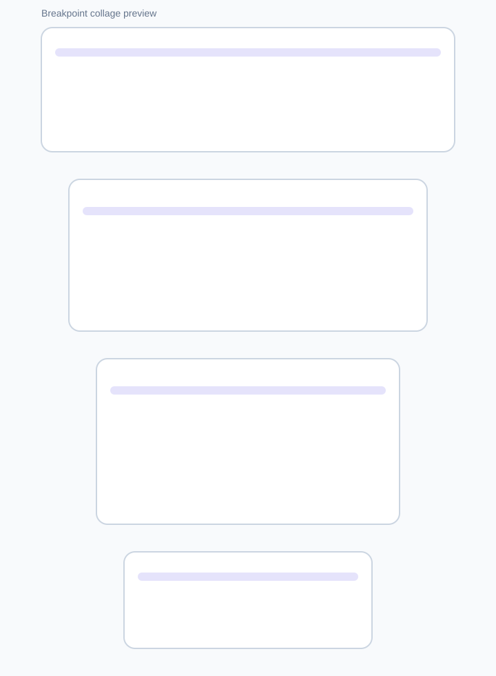
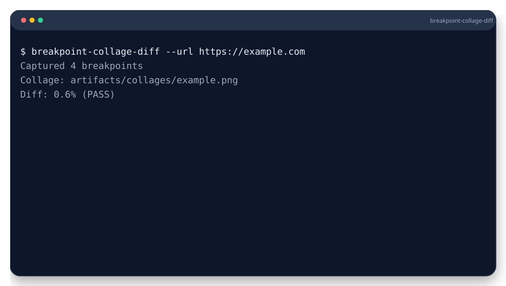

<picture>
  <source srcset="branding/hero.svg" type="image/svg+xml">
  
</picture>

# Breakpoint Collage Diff
Collage all breakpoints and catch visual regressions fast. Posts a PR comment with a single collage image.

**Type:** CLI (Node.js)

   

> [!IMPORTANT]
> This tool loads URLs in headless Chromium. Run it only against pages you trust.

## Highlights
- Captures multiple breakpoints with Playwright.
- Generates collage and diff artifacts for PRs.
- Threshold-based pass/fail for regressions.


## Output


Example artifacts live in `examples/`.

Need help? Start with `docs/troubleshooting.md`.

Baselines live in `baseline/` by default. Update with `--update-baseline`.


## Quickstart
```bash
npx breakpoint-collage-diff --url https://example.com
```


## CI in 60s
```yaml
- name: Install Playwright browsers
  run: npx playwright install --with-deps
- name: Capture collages
  run: npx breakpoint-collage-diff --url https://example.com --max-diff-pct 0.01
```

## Demo


```bash
breakpoint-collage-diff --urls urls.txt --breakpoints 375,768,1280
```


## Compatibility
- Node.js: 20 (CI on ubuntu-latest).
- OS: Linux in CI; macOS/Windows unverified.
- External deps: Playwright browsers (`npx playwright install`).

## Guarantees & Non-Goals
**Guarantees**
- Pixel diff computed via pixelmatch with explicit thresholds.
- Baselines stored locally in your repo.

**Non-Goals**
- Not a hosted visual regression service.
- Pixel-perfect parity across OS/font stacks is not guaranteed.

## Docs
- [Requirements](docs/requirements.md)
- [Usage](docs/usage.md)
- [Stability](docs/stability.md)
- [Baselines](docs/baselines.md)
- [Output](docs/output.md)
- [Troubleshooting](docs/troubleshooting.md)
- [Guarantees & Non-Goals](docs/guarantees.md)
- [Constraints](docs/constraints.md)

More: [docs/README.md](docs/README.md)

## Examples
See `examples/README.md` for inputs and expected outputs.

## Used By
Open a PR to add your org.


## Contributing
See `CONTRIBUTING.md`.

## License

MIT
